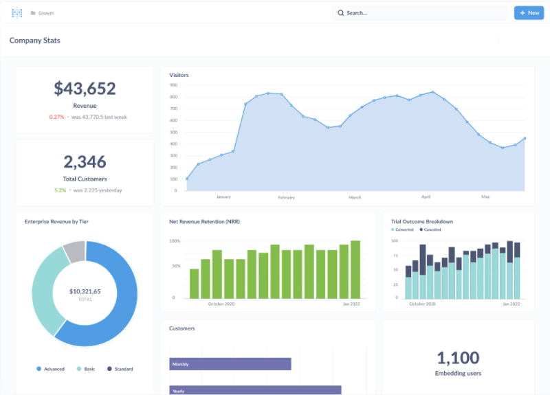
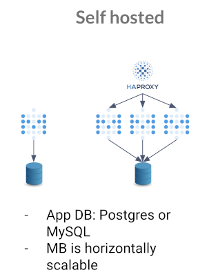
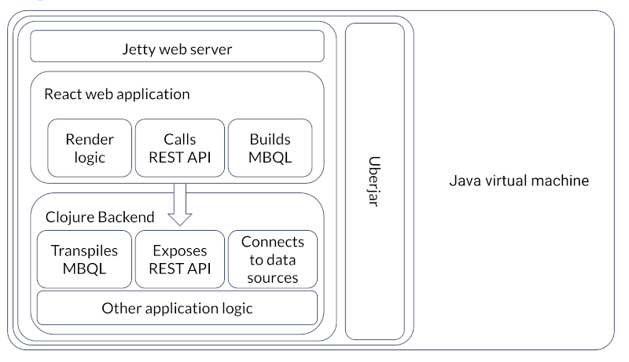
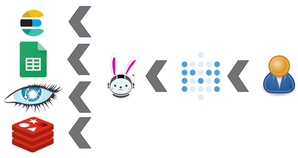
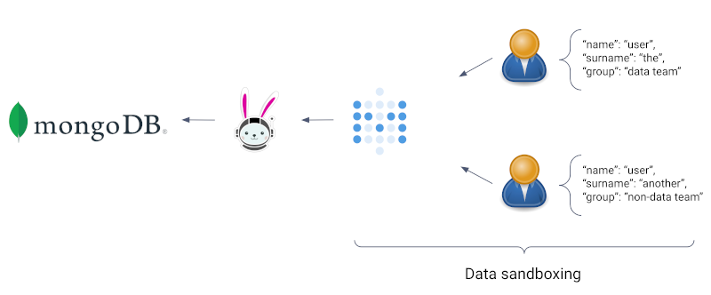
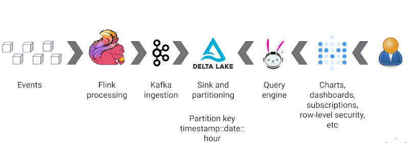

## Hosts

* Manfred Moser, Director of Information Engineering at
  [Starburst](https://starburst.io)
  ([@simpligility](https://twitter.com/simpligility))

## Guests

* [Luis Paolini](https://www.linkedin.com/in/luispaolini/), Success Engineer at
  [Metabase](https://www.metabase.com/)
* [Andrew DiBiasio](https://www.linkedin.com/in/andrewdibiasio/), Software
  Engineer at [Starburst](https://starburst.io)
* [Piotr Leniartek](https://www.linkedin.com/in/piotrleniartek), Product Manager
  at [Starburst](https://starburst.io)

## Recap of Trino in 2022

Highlights from the blog post [The rabbit reflects on Trino in 2022]() touch upon various aspects.

* Lots of growth for the community celebrating 10 years Trino
* Trino Summit, Cinco de Trino, Trino Community Broadcast, and more content
* Trino: The Definitive Guide second edition

Lots of Trino releases and new features:

* `MERGE` support
* JSON functions
* Table functions
* Fault-tolerant execution
* Upgrade to Java 17
* New Delta Lake, Hudi, and MariaDB connectors
* Tons and tons of performance improvements

## Releases 404 to 406

Official highlights from Martin Traverso:

[Trino 404]({{site.url}}/docs/current/release/release-404.html) not found

[Trino 405]({{site.url}}/docs/current/release/release-405.html)

* Support for `ALTER COLUMN ... SET DATA TYPE` statement.
* Support for Apache Arrow when reading from BigQuery.
* Support for views in the Delta Lake connector.
* Support for the Iceberg REST catalog.
* Support for Protobuf encoding in the Kafka connector.
* Support for fault-tolerant execution in the MongoDB connector.
* Support for `DELETE` and query pushdown in the Redshift connector.
* Performance improvements when reading Parquet data.

[Trino 406]({{site.url}}/docs/current/release/release-406.html)

* Support for JDBC catalog in the Iceberg connector.
* Support for fault-tolerant execution in the BigQuery connector.
* Support for exchange spooling on HDFS.
* Support for `CHECK` constraints with `INSERT` statements.
* Improved performance for Parquet files with the Delta Lake, Hive, Hudi and
  Iceberg connectors.

More detailed information is available in the release notes for
[Trino 405]({{site.url}}/docs/current/release/release-405.html),
and
[Trino 406]({{site.url}}/docs/current/release/release-406.html).

We also shipped trino-python-client 0.321.0 with the following improvements:

* Add support for SQLAlchemy 2.0.
* Add support for `varbinary` query parameters.
* Add support for variable precision `datetime` types.

## What is Metabase


[Metabase](https://www.metabase.com/) is the  easy, open-source BI tool with the
friendly UX and integrated tooling to let your company explore data on their
own. Everyone in your company can ask questions and learn from your data.

Running Metabase locally is easy. Try with a container runtime and the 300 MB
image:

```
docker run -it -p 3000:3000 metabase/metabase
```

Or use a JVM and the 260MB single JAR file:

```
wget https://downloads.metabase.com/latest/metabase.jar
java -jar metabase.jar
```

You can go zero to dashboard in under 6 minutes - [learn more from the
demo](https://www.metabase.com/demo).



Core features and advantages of Metabase include the following:

* Visual query build
* Dashboards
* Models

Metabase is a web-based application that you run on a server. You can make it
available to multiple users. It uses SQL to create queries, reports,
visualizations, dashboards, and more.

You can host it yourself locally, run it in your own datacenter or use the
cloud:




Metabase is an open source project licensed under the GNU Affero General Public
License (AGPL) license. It is written in Clojure and therefore runs on the Java
virtual machine.

Following is a high-level architecture diagram:



Metabase is also the name of the company, founded in 2014. It provides an
expanded version under a commercial license, a SaaS version of the application,
support and others services, and manages the open source project.

Metabase is running in more than 50K instances around the world, including over
2K using the SaaS version.

## History of Metabase and Trino

Metabase was first released in 2015 as version 0.9. Since the initial release it
has grown to be a well known and widely used BI application.

A Presto driver was created in 2018. It directly integrated with the client REST
API. With the rename of Presto to Trino, Manfred [created a
PR](https://github.com/metabase/metabase/pull/15160) that replicates this for
Trino to ensure continued support for the community. In the discussion it was
decided that it would be better to use the Trino JDBC driver, similar to how
other drivers for Metabase work.

After some more demand from the user and customer community, Starburst and
Metabase established a collaboration, and started implementation of the current
driver. Piotr led the charge, Andrew buckled down and learned Clojure, and
together a first release was created and tested. The driver is now provided as
an open source project managed by Starburst.

## Core advantages of using Metabase with Trino

With Metabase and the driver for Trino, Trino users have access to a well
established and proven open source BI tool. It is suitable for internal usage in
any organization, and users can upgrade to commercial version for more demanding
deployments and use cases.

The combination of Trino and Metabase also provides a number of unique benefits
for Metabase users that are not available with typical drivers for systems.
These are typically databases that support SQL, and are limited to the specific
database.

With Trino and the driver, you have access to the following unique features:

* Metabase users can connect to databases that do no yet have a Metabase driver,
  but are supported by Trino
* Trino also enables using SQL for system that don't support SQL such as MongoDB
  or Elasticsearch, and therefore allows Metabase usage with these systems.
* With Trino you can join data from different catalogs in the same SQL query.
  This also applies to Metabase reports or visualizations.

> Can I join multiple engines? Yes <br />
> Can I join SQL and no-SQL engines? YES!

ElasticSearch, Google Spreadsheets, Cassandra, Redis and others are all
accessible with Trino. Specifically this also opens up querying object storage
data lakes on S3 and other systems with the Hive, Delta Lake, Iceberg, and Hudi
connectors - all from Metabase.



Metabase also includes support for access control for any connected datasource,
all the way to row level security. This includes Trino and can be used to secure
Trino access through Metabase to a large group of your Trino users, such as all
BI users. It can even be used to add row level security for No SQL databases.




## Demo of the episode: Metabase and Trino

Luis shows us the demo from his repository at
[https://github.com/paoliniluis/metabase-trino](https://github.com/paoliniluis/metabase-trino).
Watch our video to see it and action, and check out the instructions in the
repository to try yourself.

## Real world use cases at Meesho


[Meesho](https://www.meesho.com/) is India’s fastest growing internet commerce
company. They provide a large retail website and support small business
entrepreneurs with their platform.

Meesho relies on the Trino, Metabase and the Trino Metabase driver from
Starburst for their data platform.



Piotr and Luis share more details:

* Meesho needs the ability to query the lake, with high speed, concurrency and
  scale. It was not possible before Trino, in the form of Starburst Enterprise,
  and Metabase were introduced.
* Meesho observes more than 13 million queries from Metabase in 10 months.
* Meesho uses Metabase to add security and governance for the data assets.
* A next planned step is to integrate with [Metabase Model
  Caching](https://www.metabase.com/docs/latest/data-modeling/models#enable-model-caching-in-metabase)
  to improve user experience even more.

## PR of the episode

Let's explore the code a bit, instead of focussing on a specific PR. The whole
driver codebase is open source at
[https://github.com/starburstdata/metabase-driver](https://github.com/starburstdata/metabase-driver).

As mentioned earlier the whole driver is written in Clojure, and Andrew tells us
more about his experience writing the driver and working with the two systems.

We also talk about a recent community [PR for datetime
functions](https://github.com/starburstdata/metabase-driver/pull/59) and the
ongoing work to support model caching.

## Datanova and other Trino events

We invite you all to join us for the [free, virtual conference
Datanova](http://bit.ly/3j2N9Q9) from Starburst. Trino and related tools and
approaches are touched upon in many presentations and discussion.

If you have an event that is related to Trino, let us know so we can add it to
the [Trino events calendar](../community.html#events).

## Conclusion

Metabase and Trino are a great combination of tools. Together they unlock use
cases that are difficult or impossible to implement with other tools. Give it a
try!

## Rounding out

Check out the in-person and virtual
[Trino Meetup groups](https://www.meetup.com/pro/trino-community/).

If you want to learn more about Trino, get the definitive guide from
O'Reilly. You can download
[the free PDF](https://www.starburst.io/info/oreilly-trino-guide/) or
buy the book online.

Music for the show is from the [Megaman 6 Game Play album by Krzysztof
Slowikowski](https://krzysztofslowikowski.bandcamp.com/album/mega-man-6-gp).
