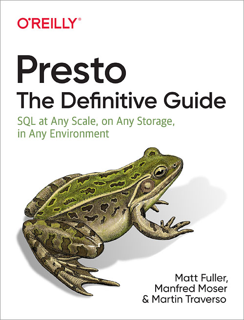

  

  

Title:
: Presto: The Definitive Guide

Subtitle:
: SQL at Any Scale, on Any Storage, in Any Environment

> The project has moved to the
> [new name Trino](), and the content
> of this book continues to apply to Trino.

Authors:
: By [Matt Fuller](https://github.com/mattsfuller),
  [Martin Traverso](https://github.com/martint),
  [Manfred Moser](https://github.com/mosabua)

Publisher:
: [O'Reilly Media](https://www.oreilly.com/)

Release Date:
: April 2020

Pages:
: 310

Perform fast interactive analytics against different data sources using the
Presto high-performance, distributed SQL query engine. With this practical
guide, you’ll learn how to conduct analytics on data where it lives, whether
it’s Hive, Cassandra, a relational database, or a proprietary data store.
Analysts, software engineers, and production engineers will learn how to manage,
use, and even develop with Presto.

Initially developed by Facebook, open source Presto is now used by Netflix,
Airbnb, LinkedIn, Twitter, Uber, and many other companies. Matt Fuller, Manfred
Moser, and Martin Traverso from Starburst show you how a single Presto query can
combine data from multiple sources to allow for analytics across your entire
organization.

Get started: Explore Presto’s use cases and learn about tools that will help you
connect to Presto and query data

Go deeper: Learn Presto’s internal workings, including how to connect to and
query data sources with support for SQL statements, operators, functions, and
more

Put Presto in production: Use this query engine for security and monitoring and
with other applications; learn how other organizations apply Presto

* [O'Reilly Media book page](http://shop.oreilly.com/product/0636920206880.do)
* [Example code repository]({{site.github_org_url}}/presto-the-definitive-guide)
* [Announcement blog post]({{ site.baseurl }})

