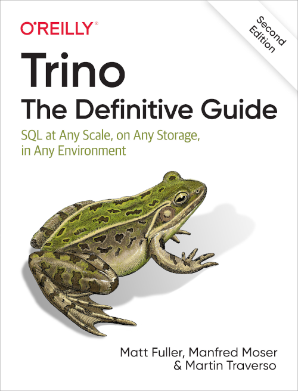

  

  

Title:
: Trino: The Definitive Guide

Subtitle:
: SQL at Any Scale, on Any Storage, in Any Environment

Authors:
: By [Matt Fuller](https://github.com/mattsfuller),
  [Martin Traverso](https://github.com/martint),
  [Manfred Moser](https://github.com/mosabua)

Publisher:
: [O'Reilly Media](https://www.oreilly.com/)

Release date:
: April 2020 as Presto: The Definitive Guide
: April 2021 updated to Trino: The Definitive Guide
: October 2022 as Trino: The Definitive Guide, Second Edition

Pages:
: 319

Perform fast interactive analytics against different data sources using the
Trino high-performance distributed SQL query engine. In the second edition of
this practical guide, you'll learn how to conduct analytics on data where it
lives, whether it's a data lake using Hive, a modern lakehouse with Iceberg or
Delta Lake, a different system like Cassandra, Kafka, or SingleStore, or a
relational database like PostgreSQL or Oracle.

Analysts, software engineers, and production engineers learn how to manage, use,
and even develop with Trino and make it a critical part of their data platform.
Authors Matt Fuller, Manfred Moser, and Martin Traverso show you how a single
Trino query can combine data from multiple sources to allow for analytics across
your entire organization.

Get started: Explore Trino's use cases and learn about tools that help you
connect to Trino for querying and processing huge amounts of data

Go deeper: Learn Trino's internal workings, including how to connect to and
query data sources with support for SQL statements, operators, functions, and
more

Put Trino in production: Deploy and secure Trino at scale, monitor workloads,
tune queries, and connect more applications; Learn how other organizations apply
Trino successfully

* [O'Reilly Media book page](https://www.oreilly.com/library/view/trino-the-definitive/9781098137229/)
* [Chinese translation available from JD](https://item.jd.com/10028492426649.html)
* [Example code repository]({{site.github_org_url}}/trino-the-definitive-guide)
* [Free digital copy from Starburst](https://www.starburst.io/info/oreilly-trino-guide/)
* [Announcement blog post]({{ site.baseurl }})
* [Announcement blog post for first Trino version]({{ site.baseurl }})
* [Announcement blog post for second edition]({{ site.baseurl }})

